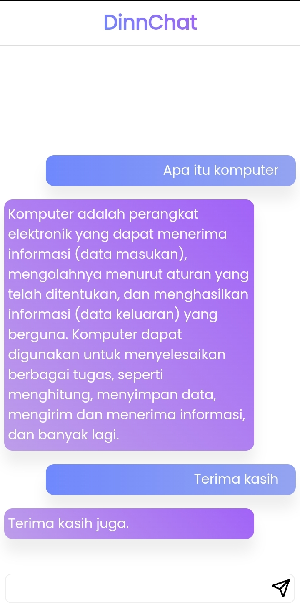

<h1 align="center">DinnChat</h1>

<p align="center">
Aplikasi kecerdasan buatan yang dapat menjawab pertanyaan anda secara realtime
</p>

<p align="center">


</p>

<p align="center"> 

</p>

## instalasi
- clone repo ini
- copy file .env_example menjadi .env
- isi OPENAI_TOKEN dengan token dari situs resmi openai atau [klik disini](https://platform.openai.com/account/api-keys) 
- install semua dependency yang di butuhkan dengan menjalankan 
    ```sh
    npm install
    ```
- jalankan aplikasi dengan mengetikkan
    ```sh
    npm start
    ```
#### powered by OpenAI
